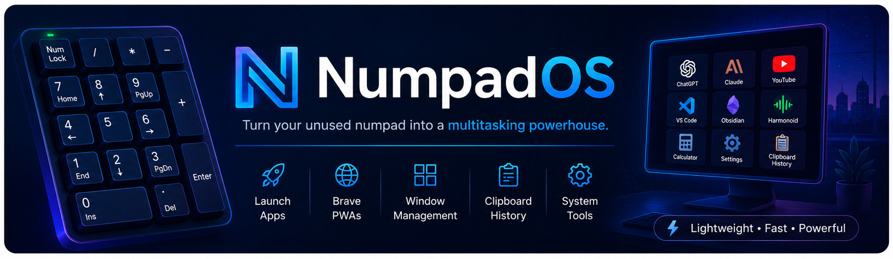
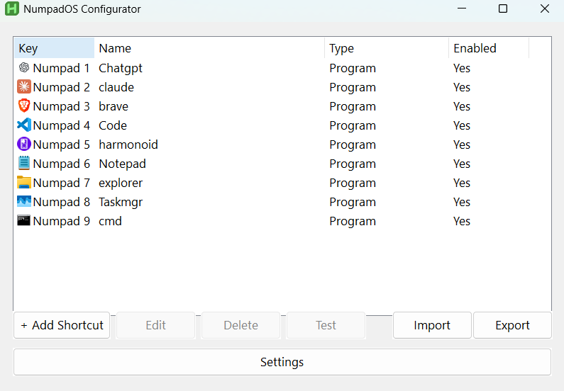
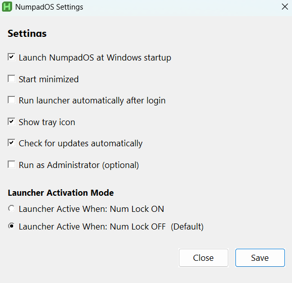
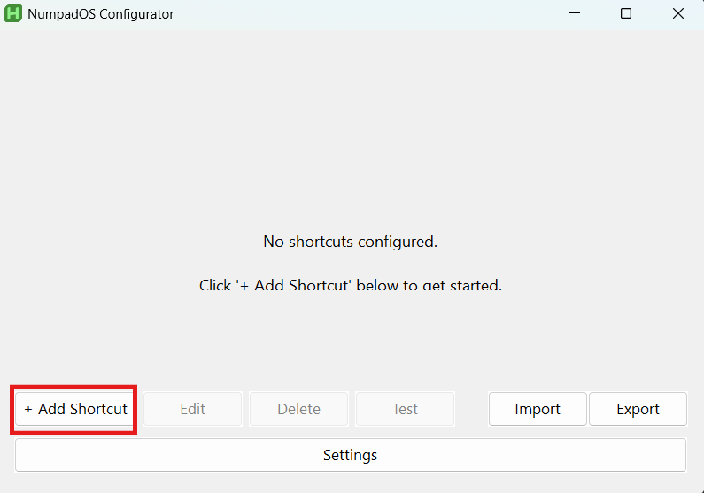

<p align="center">
  
</p>

<h1 align="center">⌨️ NumpadOS</h1>

<p align="center">
Turn your unused numpad into a multitasking powerhouse.
</p>

<p align="center">
A modern Windows productivity launcher built with <b>AutoHotkey v2</b>.
</p>

---

# ✨ Features

- 🚀 Launch applications instantly
- 📂 Open folders
- 🌐 Open websites
- ⌨️ Execute keyboard shortcuts
- 🧠 Smart Launch (focus existing windows instead of opening duplicates whenever possible)
- 🖥️ Modern graphical configurator
- 📋 Import / Export configuration
- 💾 Automatic configuration validation
- 🔄 Launch at Windows startup
- 📜 Logging system
- 🎯 Lightweight and fast
- ⚙️ No manual Config editing required

---

# 📸 Screenshots

## Main Window



---

## Settings



---

# 📦 Requirements

- Windows 10 or Windows 11
- AutoHotkey v2

Download AutoHotkey:

https://www.autohotkey.com/

---

# 🚀 Installation

1. Download the latest release.
2. Open the download folder and Extract the ZIP.
3. Install AutoHotkey v2 (link https://www.autohotkey.com/).
4. Run **Launcher.ahk**.
5. A H icon will appear in taskbar (click upword arrow to show hidden icons).
6. Right-click the tray icon.
7. Click **Configure**.

That's it.

---

# ⚙️ Creating Your First Shortcut

Click **Add Shortcut**

## Main Window



---


Choose:

- Numpad Key
- Shortcut Type
- Target

Save.

Your shortcut is ready.

---

# 📁 Supported Shortcut Types

✅ Application (.exe)

✅ Folder

✅ Website

✅ Keyboard Shortcut

---

# 🔍 How to Find an Application (.exe) Path

The easiest and most reliable method is through **Task Manager**.

## Step 1

Open the application you want to add.

Example:

- VS Code
- Discord
- Steam
- Spotify

---

## Step 2

Press

```
Ctrl + Shift + Esc
```

to open **Task Manager**.

---

## Step 3

Go to the **Details** tab.

---

## Step 4

In search bar write application name and Right click (application).exe.

Example:

```
Code.exe
Discord.exe
Steam.exe
```

---

## Step 5

click properties.

Choose

```
Open file location
```

---

## Step 6

File Explorer will open.

Right-click the (application).exe.

Choose

```
Copy as path
```

---

## Step 7

Paste the path into NumpadOS.

Example:

```
C:\Users\Pardeep\AppData\Local\Programs\Microsoft VS Code\Code.exe
```

Done!

---

# 📂 Configuration

NumpadOS stores all settings automatically.

No manual editing is required.

---

# 📊 Logging

Launcher and Configurator automatically generate log files.

Useful for troubleshooting.

---

# 🛣️ Roadmap

## ✅ Version 2.0

- Modern GUI
- Smart Launch
- JSON Configuration
- Tray Menu
- Startup Support
- Import / Export
- Logging
- Validation

---

## 🚀 Planned for Version 2.1

- Brave PWA Support
- Chrome PWA Support
- Edge PWA Support
- Firefox PWA Support
- Better Browser Detection
- Improved Smart Launch

---

## 🚀 Planned for Version 2.2

Multiple actions per key.

Examples:

Single Press

Double Press

Long Press

Different actions for the same key.

---

## 🚀 Planned for Future Releases

- Profiles
- Macros
- Plugin System
- Custom Themes
- More Shortcut Types
- Portable Mode

---

# 🤝 Contributing

Bug reports, feature suggestions and pull requests are always welcome.

If you have an idea that can improve productivity, feel free to open an issue.

---

# ⭐ Support the Project

If you enjoy NumpadOS, consider giving the repository a ⭐ on GitHub.

It really helps the project grow.

---

# 📄 License

This project is released under the MIT License.
